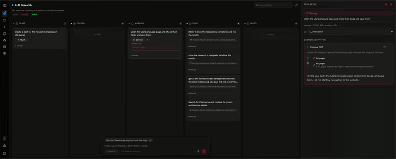
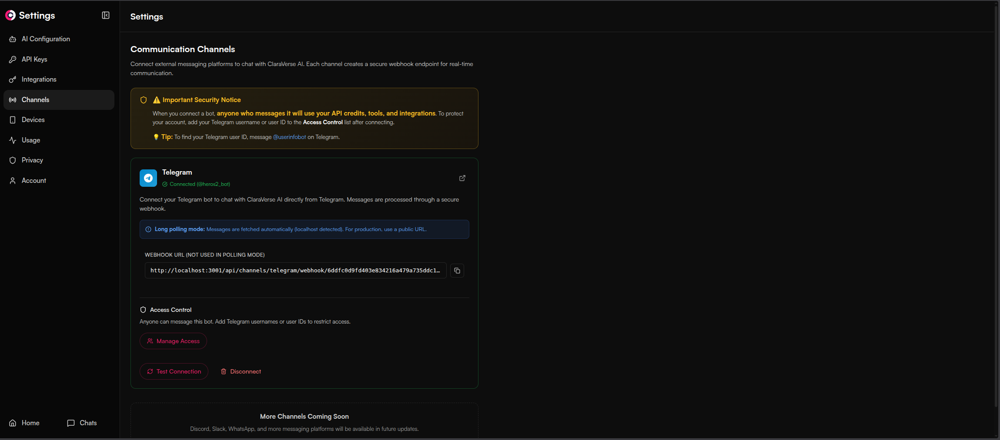

<div align="center">


### **Your Private AI Workspace**

*Built by the community, for the community. Private AI that respects your freedom.*

<p>

[](LICENSE)
[](https://github.com/claraverse-space/ClaraVerse/stargazers)
[](https://hub.docker.com/r/claraverseoss/claraverse)
[](https://discord.com/invite/j633fsrAne)

[Website](https://claraverse.space) · [Documentation](#documentation) · [Quick Start](#quick-start) · [Community](#community) · [Contributing](#contributing)

</p>
</div>

## What is ClaraVerse?

ClaraVerse is a private AI workspace that combines chat, visual workflows, long-running tasks, and Telegram integration in one app. Assign Clara research, coding, or automation tasks and track everything on a board. Use OpenAI, Claude, Gemini, or local models like Ollama — with browser-local storage that keeps your conversations private.

If you have **Ollama** or **LM Studio** running on your machine, ClaraVerse detects them automatically and imports all your models — zero configuration.

<p align="center">

</p>

---

## Quick Start

### One-line install (Linux / macOS)

```bash
curl -fsSL https://raw.githubusercontent.com/claraverse-space/ClaraVerse/main/cli/install.sh | bash && claraverse init
```

### Docker Compose

```bash
git clone https://github.com/claraverse-space/ClaraVerse.git
cd ClaraVerse
docker compose -f docker-compose.production.yml up -d
```

Open **http://localhost:3000** — register your account (first user becomes admin) and start chatting.

> **Have Ollama running?** ClaraVerse auto-detects it and imports all your models. No setup needed.
> Make sure Ollama is listening on `0.0.0.0` (set `OLLAMA_HOST=0.0.0.0` in your Ollama config).

<details>
<summary><b>Docker run (single command)</b></summary>

```bash
docker run -d \
  --name claraverse \
  -p 3000:3000 \
  -v claraverse-data:/app/data \
  -v claraverse-uploads:/app/uploads \
  --add-host=host.docker.internal:host-gateway \
  ghcr.io/claraverse-space/claraverse:latest
```

This runs ClaraVerse with a single container. For the full stack with MySQL, MongoDB, Redis, and SearXNG, use the Docker Compose setup above.

</details>

<details>
<summary><b>Advanced configuration</b></summary>

### Prerequisites
- Docker & Docker Compose v2+
- 4 GB RAM minimum (8 GB recommended)
- Ollama, LM Studio, or any OpenAI-compatible API

### Environment variables

Override defaults by creating a `.env` file next to `docker-compose.production.yml`:

```bash
# Port (default 3000)
CLARAVERSE_PORT=8080

# Point to a custom Ollama or LM Studio URL
OLLAMA_BASE_URL=http://host.docker.internal:11434
LMSTUDIO_BASE_URL=http://host.docker.internal:1234
```

### Local AI auto-detection

ClaraVerse automatically discovers local AI providers running on your host machine:

| Provider | Default URL | What happens |
|----------|-------------|--------------|
| **Ollama** | `http://host.docker.internal:11434` | Models imported, provider created, visibility set |
| **LM Studio** | `http://host.docker.internal:1234` | Models imported via OpenAI-compatible API |

The discovery runs every 2 minutes. When a provider goes offline, it's automatically disabled. When it comes back, models are re-imported.

**Ollama setup tip:** Ollama defaults to `127.0.0.1` which Docker containers can't reach. Set `OLLAMA_HOST=0.0.0.0`:

```bash
# If using systemd:
sudo systemctl edit ollama
# Add under [Service]:
# Environment="OLLAMA_HOST=0.0.0.0"
sudo systemctl restart ollama
```

### Troubleshooting

```bash
# View logs
docker compose -f docker-compose.production.yml logs -f claraverse

# Restart
docker compose -f docker-compose.production.yml restart

# Fresh start (removes all data)
docker compose -f docker-compose.production.yml down -v && docker compose -f docker-compose.production.yml up -d
```

</details>

---

## Core Capabilities

### Nexus — Your AI Command Center
Assign Clara long-running tasks like research, coding, or analysis. Track everything on a Kanban board — you always know what she's working on and why. No black box.
<p align="center">
  
</p>

### Skills in Chat
Clara uses skills mid-conversation — context-aware tools that activate when needed. Search the web, generate images, analyze data, all without leaving the chat.
<p align="center">
  
</p>

### Channels — Telegram Integration
Talk to Clara from Telegram when you're away from the app. Set up routines that run on a schedule and report back to your phone.
<p align="center">
  
</p>

### Interactive Artifacts
Have all your creations in one place — images, charts, games, apps and more.
<p align="center">
  
</p>

### AI Docs
Built-in tools for PPT, PDF, CSV and much more.
<p align="center">
  
</p>

### Interactive Chat UI (Human in the Loop)
The AI asks you visual questions when it needs your input.
<p align="center">
  
</p>

### Workflows — Visual Automation
Drag-and-drop workflow builder with parallel execution, scheduling, and 200+ integrations. Describe what you need and let the LLM build the automation for you.
<p align="center">
  
</p>

### Schedule, API and Automate
Use workflows with your web apps, schedule daily messages, automate repetitive tasks.
<p align="center">
  
</p>

---

## Key Features

| Feature | Description |
|---------|-------------|
| **Nexus** | Assign long-running tasks, track progress on a Kanban board |
| **Skills** | Context-aware tools that activate mid-conversation when needed |
| **Channels** | Telegram integration — talk to Clara from your phone |
| **Routines** | Scheduled task sequences that report back via Telegram |
| **Workflows** | Drag-and-drop builder with parallel execution, scheduling, 200+ integrations |
| **Devices** | Connect all your machines — Clara reaches MCP on any of them remotely |
| **Clara Companion** | Bridge local MCP servers to ClaraVerse over WebSocket from any machine |
| **Browser-Local Storage** | Conversations stay in IndexedDB — zero-knowledge architecture |
| **Local AI Auto-Detection** | Ollama and LM Studio discovered and imported automatically |
| **Multi-Provider** | OpenAI, Anthropic, Google, Ollama, any OpenAI-compatible endpoint |
| **MCP Bridge** | Native Model Context Protocol support for seamless tool connections |
| **Interactive Prompts** | AI asks clarifying questions mid-conversation with typed forms |
| **Memory System** | Clara remembers context across conversations, auto-archives old memories |
| **BYOK** | Bring your own API keys or use free local models |

---

## Clara Companion (MCP Bridge)

Connect your local tools and filesystem to ClaraVerse via the Clara Companion CLI. It bridges local MCP servers to your ClaraVerse instance over WebSocket.

<p align="center">
  
</p>

```bash
# Install via the claraverse CLI
claraverse companion install

# Login (choose default localhost:3000 or enter your server URL)
claraverse companion login

# Start the bridge
claraverse companion start
```

Or install manually from [GitHub Releases](https://github.com/claraverse-space/ClaraVerse/releases).

---

## Try It Out

| Option | Description |
|--------|-------------|
| [**Cloud**](https://claraverse.space) | Free hosted version — no setup required |
| [**Self-Hosted**](#quick-start) | Docker deployment (this repo) — full control on your infrastructure |
| [**Desktop**](https://github.com/claraverse-space/ClaraVerse-Desktop) | Standalone Electron app for Windows, macOS, Linux |

---

## Tech Stack

| Layer | Technology |
|-------|-----------|
| **Frontend** | React 19, TypeScript, Vite 7, Tailwind CSS 4, Zustand |
| **Backend** | Go 1.24, Fiber, WebSocket streaming |
| **Database** | MySQL, MongoDB, Redis (all bundled in Docker Compose) |
| **Search** | SearXNG (private, self-hosted) |
| **Auth** | Local JWT with Argon2id password hashing |

---

## Development Setup

For contributors working on the codebase:

```bash
# Prerequisites: Go 1.24+, Node.js 20+, Docker

# Clone the repo
git clone https://github.com/claraverse-space/ClaraVerse.git
cd ClaraVerse

# Start backing services (MySQL, MongoDB, Redis, SearXNG)
docker compose -f docker-compose.dev.yml up -d

# Backend
cd backend
cp .env.example .env
go run cmd/server/main.go

# Frontend (separate terminal)
cd frontend
cp .env.example .env
npm install
npm run dev
```

Frontend runs at `http://localhost:5173`, backend at `http://localhost:3001`.

See [CONTRIBUTING.md](CONTRIBUTING.md) for coding standards and PR guidelines.

---

## Documentation

| Resource | Description |
|----------|-------------|
| [Architecture](docs/ARCHITECTURE.md) | System architecture and design decisions |
| [API Reference](docs/API_REFERENCE.md) | REST and WebSocket API |
| [Admin Guide](docs/ADMIN_GUIDE.md) | System administration and provider setup |
| [Developer Guide](docs/DEVELOPER_GUIDE.md) | Contributing and local development |
| [Quick Reference](docs/QUICK_REFERENCE.md) | Common commands and shortcuts |

---

## Contributing

1. Fork the repository
2. Create a feature branch: `git checkout -b feature/amazing-feature`
3. Make changes and test
4. Run `cd frontend && npm run lint && npm run type-check`
5. Commit and open a Pull Request

**Areas we need help:**
- Bug fixes ([open issues](https://github.com/claraverse-space/ClaraVerse/issues))
- New tool integrations and model providers
- Documentation improvements
- Translations

See [CONTRIBUTING.md](CONTRIBUTING.md) for the full guide.

---

## Community

- [Discord](https://discord.com/invite/j633fsrAne) — Chat and support
- [Twitter/X](https://x.com/claraversehq) — Updates
- [GitHub Issues](https://github.com/claraverse-space/ClaraVerse/issues) — Bug reports
- [GitHub Discussions](https://github.com/claraverse-space/ClaraVerse/discussions) — Feature requests

---

## License

**AGPL-3.0** — Free to use, modify, and host commercially. Modifications must be open-sourced. See [LICENSE](LICENSE) for details.

---

<div align="center">

**Built with love by the ClaraVerse Community**

[Back to Top](#your-private-ai-workspace)

## Star History

[](https://www.star-history.com/#claraverse-space/ClaraVerse&type=timeline&legend=bottom-right)

</div>
