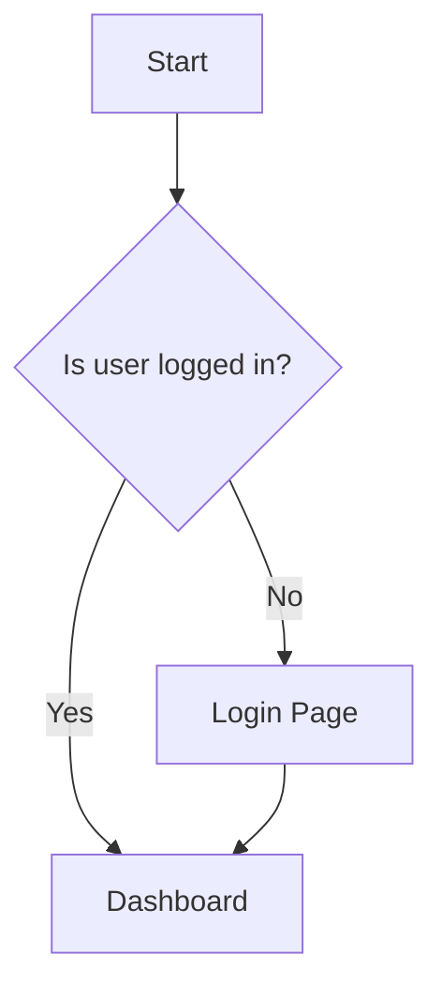

# Artifact Pane System

A Claude-style artifact rendering system for HTML, SVG, and Mermaid diagrams with zoom/pan controls and glassmorphism UI.

## Features

- **Three Artifact Types**: HTML, SVG, and Mermaid diagrams
- **Zoom & Pan**: Interactive controls for SVG and Mermaid with mouse/trackpad support
- **Glassmorphism Design**: Matches ClaraVerse's rose pink (#e91e63) accent theme
- **Resizable Split View**: Drag handle to adjust chat/artifact ratio (persisted to localStorage)
- **Tab Navigation**: Handle multiple artifacts in a single message
- **Download Support**: Export artifacts as .html, .svg, or .mermaid files
- **Sandboxed HTML**: DOMPurify sanitization with optional script execution

## Usage

### For LLM Integration

Artifacts are **automatically detected** from standard markdown code fences! Just use regular code blocks:

**Standard markdown code fences (automatically detected):**

````
```html
<!DOCTYPE html>
<html>
  <head><title>Login</title></head>
  <body>...</body>
</html>
```
````

**Supported languages:**

- ` ```html ` - Detects HTML documents (must include `<!DOCTYPE`, `<html>`, or `<body>`)
- ` ```svg ` - Detects SVG graphics (must include `<svg>`)
- ` ```mermaid ` - Detects Mermaid diagrams (any substantial content)

**Optional XML-style tags (for explicit control):**

```
<artifact type="html" title="Login Page">
<!DOCTYPE html>
<html>...</html>
</artifact>
```

### Artifact Types

| Type      | Extension  | Description           | Features              |
| --------- | ---------- | --------------------- | --------------------- |
| `html`    | `.html`    | Web pages with CSS/JS | Sandboxed iframe      |
| `svg`     | `.svg`     | Vector graphics       | Zoom, pan, auto-fit   |
| `mermaid` | `.mermaid` | Diagrams & charts     | Zoom, pan, dark theme |

### Examples

**HTML Artifact (automatically detected):**

````
```html
<!DOCTYPE html>
<html>
<head>
  <style>
    button { padding: 10px 20px; background: #e91e63; color: white; }
  </style>
</head>
<body>
  <button onclick="alert('Hello!')">Click Me</button>
</body>
</html>
```
````

**SVG Artifact (automatically detected):**

````
```svg
<svg xmlns="http://www.w3.org/2000/svg" viewBox="0 0 200 200">
  <circle cx="100" cy="100" r="50" fill="#FFD700" />
  <text x="100" y="110" text-anchor="middle" fill="white">Hello</text>
</svg>
```
````

**Mermaid Artifact (automatically detected):**

````

````

## Architecture

### Plug-and-Play Renderer System

Adding new artifact types requires only 3 steps:

1. **Create renderer** in `src/components/artifacts/renderers/NewRenderer.tsx`
2. **Add type** to `ArtifactType` union in `src/types/artifact.ts`
3. **Register** in `RENDERERS` object in `src/components/artifacts/renderers/index.ts`

### Components

```
src/components/artifacts/
├── ArtifactPane.tsx          # Main container with tabs and header
├── ZoomPanContainer.tsx      # Zoom/pan wrapper for visual content
└── renderers/
    ├── HTMLRenderer.tsx      # Sandboxed HTML with DOMPurify
    ├── SVGRenderer.tsx       # SVG with validation
    ├── MermaidRenderer.tsx   # Mermaid diagram rendering
    └── index.ts              # Renderer registry (plug-and-play)
```

### State Management

**Artifact Store** (`src/store/useArtifactStore.ts`):

- `isOpen`: Pane visibility
- `artifacts`: Array of current artifacts
- `selectedIndex`: Active tab index
- `splitRatio`: Chat/artifact split percentage (persisted)

### Parsing

**Artifact Parser** (`src/utils/artifactParser.ts`):

- `extractArtifacts(content)`: Parses both XML and code fence formats
- `hasArtifacts(content)`: Quick check for artifact markers
- Removes artifact markers from message content for clean display

## Integration

Artifacts are automatically detected and rendered when:

1. LLM stream completes (`stream_end` event)
2. Message content contains artifact markers
3. Parser extracts artifacts and opens pane
4. Message content is cleaned (markers removed)

See `src/pages/Chat.tsx` lines 501-540 for integration code.

## Customization

### Mermaid Theme

Configure in `src/components/artifacts/renderers/MermaidRenderer.tsx`:

```typescript
mermaid.initialize({
  theme: 'dark',
  themeVariables: {
    primaryColor: '#e91e63', // Rose pink accent
    // ... more customization
  },
});
```

### HTML Security

Control script execution via `allowScripts` prop:

```typescript
<HTMLRenderer content={content} allowScripts={false} />
```

Or set environment variable:

```
VITE_ARTIFACT_ALLOW_SCRIPTS=false
```

### Split Ratio

Default: 60% chat, 40% artifact. Constrained to 30-80% chat panel.

Modify in `src/store/useArtifactStore.ts`:

```typescript
splitRatio: 60, // Change default here
```

## Future Extensions

Easily add support for:

- **React components**: `react-live` renderer
- **Charts**: Chart.js/Recharts JSON config renderer
- **LaTeX**: KaTeX renderer for math equations
- **3D models**: Three.js renderer for .gltf/.obj files
- **Maps**: Leaflet/Mapbox renderer
- **Code playgrounds**: CodeSandbox/StackBlitz embed

## Dependencies

- `mermaid` - Diagram rendering
- `react-resizable-panels` - Split layout
- `dompurify` - HTML sanitization
- `react-zoom-pan-pinch` - Zoom/pan controls

## Browser Support

- Modern browsers with ES2020+
- Sandboxed iframes (HTML artifacts)
- SVG support
- Flexbox layout

## License

Part of ClaraVerse-Scarlet project.
